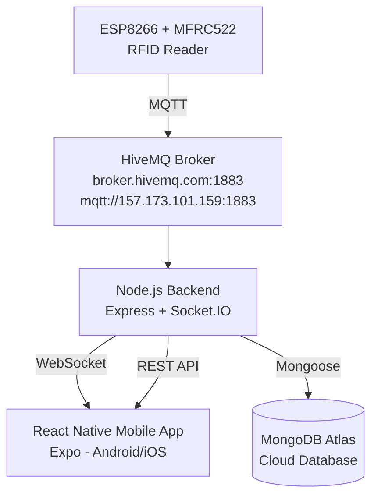
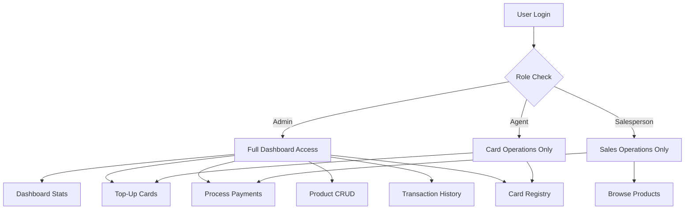
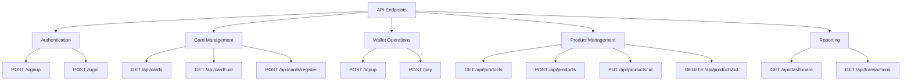
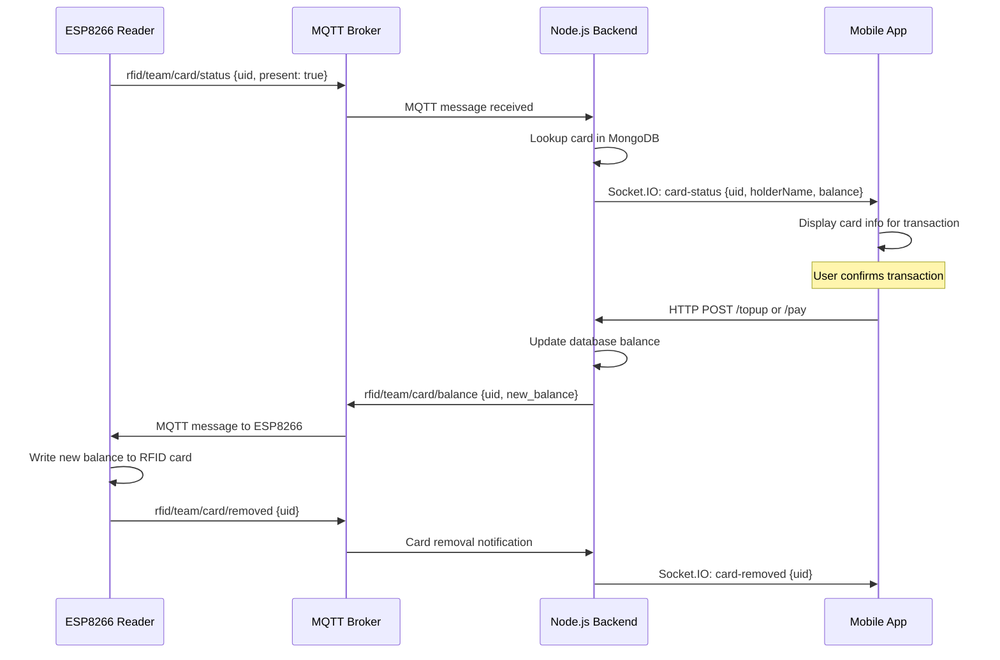

# BillIO — RFID Wallet System

> A full-stack IoT payment platform built for Y2 Mobile Dashboard Assignment.  
> RFID cards are used as digital wallets — tap to top-up, tap to pay.

---

## What It Does

BillIO connects a physical RFID reader (ESP8266 + MFRC522) to a mobile dashboard through MQTT and a REST/WebSocket backend. Three roles interact with the system:

- **Admin** — full control: dashboard stats, top-ups, payments, product management, transaction history, card registry
- **Agent** — top-up cards and register new cards
- **Salesperson** — browse products, build a cart, and process payments via RFID card

When a card is tapped on the reader, the backend receives the UID over MQTT, looks it up in MongoDB, and pushes the card data to the mobile app in real time via Socket.IO. The operator then confirms the transaction, the balance is updated in the database, and the new balance is written back to the card over MQTT.

---

## Architecture



---

## Tech Stack

| Layer | Technology |
|-------|-----------|
| Mobile App | React Native (Expo), TypeScript |
| Backend | Node.js, Express.js |
| Real-time | Socket.IO (WebSocket) |
| IoT Messaging | MQTT (mqtt.js client + HiveMQ broker) |
| Database | MongoDB Atlas (Mongoose ODM) |
| Auth | JWT (jsonwebtoken) + bcrypt |
| Hardware | ESP8266 + MFRC522 RFID reader (Arduino) |

---

## Project Structure

```
/
├── mobile_app/              # React Native (Expo) mobile dashboard
│   ├── screens/             # One file per screen
│   │   ├── HomeScreen.tsx
│   │   ├── DashboardScreen.tsx
│   │   ├── TopupScreen.tsx
│   │   ├── PaymentsScreen.tsx
│   │   ├── ProductsScreen.tsx
│   │   ├── TransactionsScreen.tsx
│   │   └── CardsScreen.tsx
│   ├── components/          # Reusable UI components
│   ├── App.tsx              # Root: auth flow + navigation + socket setup
│   ├── socket.ts            # Socket.IO singleton client
│   ├── config.ts            # API base URL
│   └── styles.ts            # Global stylesheet
│
├── backend/                 # Node.js Express server
│   ├── server.js            # Main entry: routes, MQTT, Socket.IO
│   ├── routes/
│   │   ├── authRoutes.js    # POST /signup, POST /login
│   │   └── productRoutes.js # CRUD /api/products
│   ├── models/              # Mongoose models (legacy location)
│   ├── services/
│   │   └── userService.js   # Auth logic (hash, verify, JWT)
│   ├── config/
│   │   └── database.js      # MongoDB connection
│   └── seeds/               # Legacy seed scripts
│
├── database/                # Centralised database layer
│   ├── config/
│   │   └── config.js        # MONGO_URI + connectDB export
│   ├── entities/
│   │   ├── User.js
│   │   ├── Product.js
│   │   ├── Card.js
│   │   ├── Transaction.js
│   │   └── index.js         # Barrel export
│   └── seeds/
│       ├── seedProducts.js  # Seeds 34 products
│       └── seedUsers.js     # Seeds admin / agent / salesperson
│
├── RFID_MQTT/
│   └── RFID_MQTT.ino        # Arduino sketch for ESP8266 + MFRC522
│
├── public/                  # Legacy web dashboard (PWA)
│   ├── dashboard.html
│   ├── dashboard.js
│   └── dashboard.css
│
└── mqtt_topics.md           # MQTT topic reference
```

---

## Roles & Permissions



---

## API Endpoints



---

## Socket.IO Events



---

## Database Schema

### User
```
username    String  (unique)
password    String  (bcrypt hashed)
role        String  enum: ['user', 'admin', 'agent']
```

### Card
```
uid         String  (unique) — RFID card UID
holderName  String
balance     Number  (default: 0)
lastTopup   Number
passcode    String  (bcrypt hashed, optional)
passcodeSet Boolean
createdAt   Date
updatedAt   Date
```

### Transaction
```
uid           String  — card UID
holderName    String
userId        String  — operator username
type          String  enum: ['topup', 'debit']
amount        Number
balanceBefore Number
balanceAfter  Number
description   String
timestamp     Date
```

### Product
```
id        String  (unique slug, e.g. 'coffee')
name      String
price     Number
category  String  (food | drinks | rwandan | domains | services)
createdAt Date
updatedAt Date
```

---

## MQTT Topics

See [`mqtt_topics.md`](./mqtt_topics.md) for full reference.

**Base pattern:** `rfid/1nt3ern4l_53rv3r_3rr0r/card/<event>`

| Topic suffix | Description |
|---|---|
| `/status` | Card tapped — ESP publishes UID |
| `/balance` | Backend publishes updated balance to ESP |
| `/topup` | Backend confirms top-up to ESP |
| `/payment` | Backend confirms payment to ESP |
| `/removed` | ESP publishes card removal |

---

## Setup & Running

### Prerequisites
- Node.js 18+
- MongoDB Atlas account (or use the provided URI)
- Expo CLI (`npm install -g expo-cli`)
- Android device or emulator

### Backend

```bash
cd backend
cp .env.example .env        # fill in MONGODB_URI and JWT_SECRET
npm install
node server.js
```

### Mobile App

```bash
cd mobile_app
npm install
npx expo start
```

Scan the QR code with Expo Go on your Android device.

### Seed the Database

```bash
# From project root
node database/seeds/seedProducts.js   # loads 34 products
node database/seeds/seedUsers.js      # creates admin / agent / salesperson
```

Default credentials after seeding:

| Username | Password | Role |
|----------|----------|------|
| admin | admin123 | Admin |
| agent | agent123 | Agent |
| salesperson | user123 | Salesperson |

### Environment Variables (`backend/.env`)

```env
MONGODB_URI=mongodb+srv://<user>:<pass>@<cluster>.mongodb.net/<db>
JWT_SECRET=your_secret_key
PORT1=8228
```

---

## Hardware — ESP8266 + MFRC522

The Arduino sketch in `RFID_MQTT/RFID_MQTT.ino` handles:

1. Connecting to WiFi
2. Connecting to the MQTT broker
3. Polling the MFRC522 for card presence
4. Publishing card UID to `rfid/<team_id>/card/status` on tap
5. Publishing removal event to `rfid/<team_id>/card/removed`
6. Subscribing to `rfid/<team_id>/card/balance` to receive updated balance and write it back to the card's memory block

---

## Deliverables Checklist (Assignment)

- [x] Agent login + wallet top-up
- [x] Salesperson login + product selection + payment
- [x] Dashboard with live stats (cards, balance, transactions, top-ups, payments)
- [x] Balance update after every transaction
- [x] MQTT communication with ESP8266
- [x] Role-based navigation (Admin / Agent / Salesperson)
- [x] `README.md`
- [x] `mobile_app/`
- [x] `backend/`
- [x] `database/`
- [x] `mqtt_topics.md`
