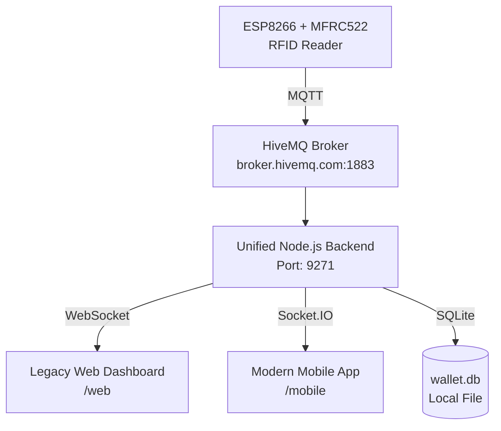

# BillIO — Unified RFID Wallet System

> A unified full-stack IoT payment platform.  
> RFID cards are used as digital wallets — tap to top-up, tap to pay.

---

## What It Does

BillIO connects a physical RFID reader (ESP8266 + MFRC522) to a unified dashboard through MQTT and a Node.js backend using **SQLite**. One server (Port 9271) serves both the legacy Web Dashboard and the modern Mobile App.

- **Admin** — full control: dashboard stats, top-ups, payments, product management, transaction history, card registry
- **Agent** — top-up cards and register new cards
- **Salesperson** — browse products, build a cart, and process payments via RFID card

When a card is tapped, the UID is sent via MQTT. The backend lookups the user in the local `wallet.db` (SQLite) and pushes status to both the Web Dashboard (WebSocket) and Mobile App (Socket.IO).

---

## Architecture



---

## Tech Stack

| Layer | Technology |
|-------|-----------|
| Mobile App | React Native (Expo), TypeScript |
| Web Dashboard | Vanilla JS, HTML5, CSS3 |
| Backend | Node.js (v20+), Express.js |
| Real-time | Socket.IO (Mobile) + ws (Web Dashboard) |
| IoT Messaging | MQTT (mqtt.js + HiveMQ) |
| Database | **SQLite** (better-sqlite3) |
| Auth | JWT (jsonwebtoken) + bcrypt |
| Hardware | ESP8266 + MFRC522 |

---

## Project Structure

```
/
├── backend/                 # Unified Node.js Express server
│   ├── server.js            # Unified Entry: Routes, MQTT, WS, Socket.IO
│   ├── wallet.db            # Unified SQLite Database
│   ├── firmware/            # ESP8266 Source Code
│   ├── web_public/          # Legacy Web Dashboard files (/web)
│   ├── mobile_dist/         # Built Mobile App files (/mobile)
│   ├── config/
│   │   └── sqlite_database.js # SQLite Logic & Schema
│   ├── routes/              # Express API Routes
│   └── services/            # Shared Auth Logic
│
├── mobile_app/              # React Native (Expo) Source Code
│   ├── screens/             # UI Screens
│   └── config.ts            # Unified Port Configuration
│
├── mqtt_topics.md           # MQTT topic reference
└── README.md                # This file
```

---

## Setup & Running

### Prerequisites
- Node.js **20.x** or higher (required for `better-sqlite3`)
- Expo CLI (for mobile development)

### Running the Unified Backend

```bash
cd backend
npm install
node server.js
```

The server will be available at:
- **Web Dashboard**: `http://localhost:9271/web`
- **Mobile App**: `http://localhost:9271/mobile`

### Environment Variables (`backend/.env`)

```env
JWT_SECRET=your_secret_key
PORT1=9271
```

---

## Deployment (VPS)

To run the system persistently on a VPS:

```bash
# 1. Kill any process on port 9271
fuser -k 9271/tcp || true

# 2. Start using nohup
cd backend
nohup node server.js > output.log 2>&1 &
```

---

## Hardware — ESP8266 + MFRC522

The Arduino sketch in `backend/firmware/RFID_MQTT/RFID_MQTT.ino` handles:

1. Connecting to WiFi & MQTT
2. Publishing card UID to `rfid/<team_id>/card/status`
3. Writing updated balances back to the RFID card over MQTT.

---

## Deliverables Checklist

- [x] Migrated MongoDB to SQLite
- [x] Unified Backend on Port 9271
- [x] Path-based routing: `/web` (Legacy) and `/mobile` (Modern)
- [x] Real-time MQTT + WebSocket Integration
- [x] Cleaned repository structure
