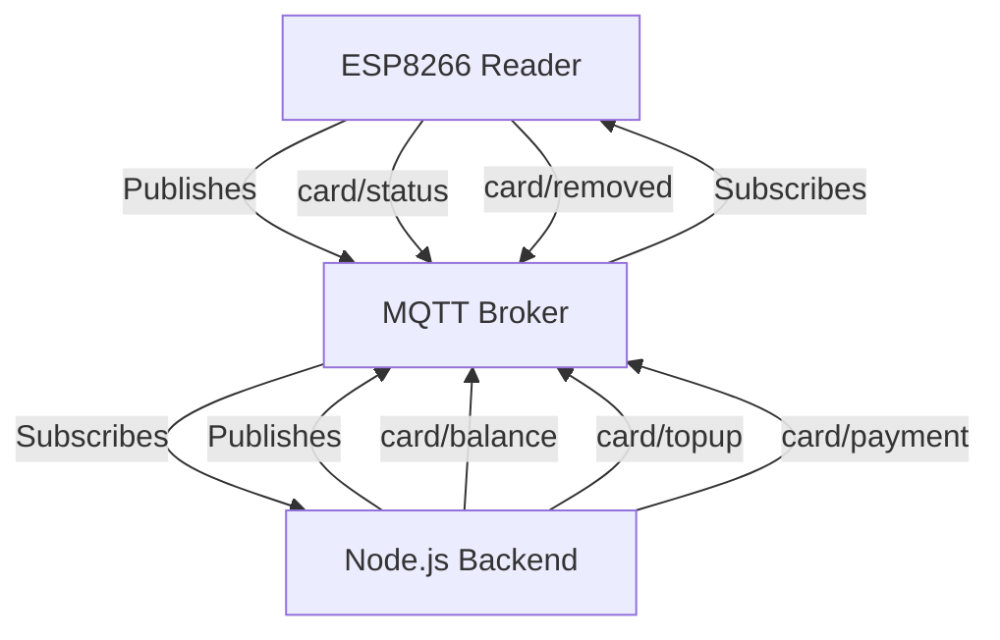

# MQTT Topics — BillIO RFID Wallet System

**Team ID:** `1nt3ern4l_53rv3r_3rr0r`

All topics follow the pattern: `rfid/<team_id>/card/<event>`

---

## MQTT Communication Flow



## Topics

| Topic | Direction | Description |
|-------|-----------|-------------|
| `rfid/<team_id>/card/status` | ESP → Backend | Card tapped on reader. Payload includes `uid`, `status`, `present`, `ts` |
| `rfid/<team_id>/card/balance` | Backend → ESP | Updated balance after topup/payment. Payload: `{ uid, balance }` |
| `rfid/<team_id>/card/topup` | Backend → ESP | Topup confirmed. Payload: `{ uid, amount }` (amount = new total balance) |
| `rfid/<team_id>/card/payment` | Backend → ESP | Payment confirmed. Payload: `{ uid, amount, deducted, description, status }` |
| `rfid/<team_id>/card/removed` | ESP → Backend | Card removed from reader. Payload: `{ uid }` |

---

## Payload Examples

### Card Status (ESP → Backend)
```json
{
  "uid": "A1B2C3D4",
  "status": "present",
  "present": true,
  "ts": 1710000000000
}
```

### Topup Command (Backend → ESP)
```json
{
  "uid": "A1B2C3D4",
  "amount": 25.00
}
```

### Payment Result (Backend → ESP)
```json
{
  "uid": "A1B2C3D4",
  "amount": 22.50,
  "deducted": 2.50,
  "description": "Purchase: Coffee",
  "status": "success"
}
```

---

## MQTT Broker

- **Broker:** `broker.hivemq.com:1883` (public, for development)
- **Protocol:** MQTT over TCP
